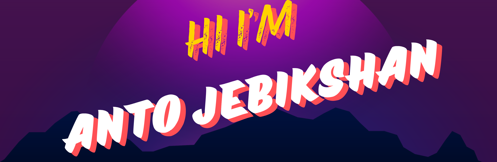

 

As a passionate and driven third-year Computer Science and Engineering undergraduate, I have developed a comprehensive skill set in both problem solving skills and development skills.

## About Me

### Innovative Technologist
Skilled in [Your Specialty], dedicated to crafting high-quality solutions with a focus on precision and creativity.

### Outcome-Oriented Professional
Experienced in leveraging expertise to achieve significant results and drive project success.

### Analytical Strategist
Adept at using strategic insights to tackle complex challenges and deliver effective solutions.

### Team-Oriented Leader
Proven ability to collaborate with diverse teams to achieve common objectives and foster innovation.

### Lifelong Learner
Committed to staying updated with the latest industry trends and technologies to continually enhance my skills and knowledge.

<code></code>
<code></code>
<code></code>
<code></code>
<code></code>    

|  |  |
| ------------- | ------------- |

#### Top Repositories

 
 

