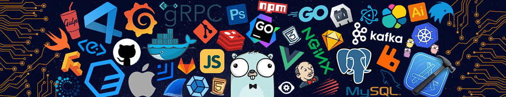

## Hi I'm Anto Jebikshan !

  

## The Journey So Far

  As a <strong style="font-weight: bold; color: #007BFF;">passionate and driven third-year Computer Science and Engineering undergraduate</strong> , I have developed a comprehensive skill set in both <strong style="font-weight: bold; color: #28A745;">problem-solving</strong>  and <strong style="font-weight: bold; color: #FFC107;">development</strong> . From tackling complex algorithms  to building innovative projects , I thrive on exploring new technologies  and pushing my limits . Always eager to learn and grow , I aim to apply my knowledge to real-world challenges  and create impactful solutions .

  

## About Me

- 🎓 **CSE Undergraduate** : 
  Passionate about learning and growing in the field of Computer Science. Eager to apply academic knowledge to real-world projects.

- 💼 **Aspiring Web DEV,AI&DS**
  Currently studying and building skills in Web development, with a focus on creating engaging and user-friendly interfaces both frontend and backend and also in AI

- 📈 **Project Contributor** : 
  Developed and contributed to projects in React and Django 

- ❤️ **Data Science and AI Enthusiast**
  Enjoy writing Data Science and AI and exploring advanced programming concepts. Always looking for new ways to experiment and innovate.

- 💬 **Open to Discussions** : 
  Feel free to ask me anything or discuss projects . I'm always open to new ideas and collaboration opportunities.
 

## Skills

  <code></code>
  <code></code>
  <code></code>
  <code></code>
  <code></code>
  <code></code>
  <code></code>
  <code></code>
  <code></code>
  <code></code>

#### Top Repositories

 
 

